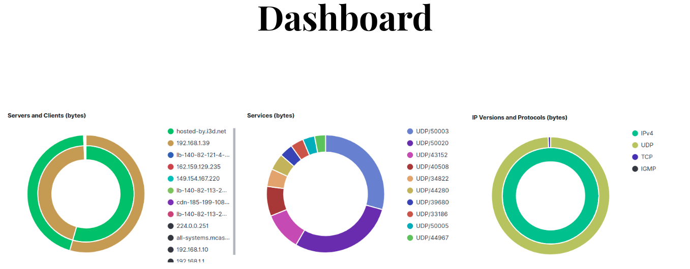

# TMA Project Group A1 - FlowNOW
## Introduction
FlowNOW is a simple network monitoring tool aimed for small-medium companies. The idea is to keep it as simple for the companies, while also providing complete and accurate analysis. Companies will need to install our product in the network, and with simple configuration we will notify them of any incidence detected by our surveilence team. We can think of it as a classical "Home alarm system" but for the internet. In fact, if an attack was detected, our company could contact an "attack forensics" company to try to evaluate the damage.

## Simple test from home
The simplest test is to run ther exporter and collector on the same computer. In order to do this, you will need to have ```docker``` and ```python3``` installed. ```Docker``` is used to run the exporter and collector, and ```python``` is used for the Telegram monitoring bot.

### Run exporter and collector

To start the collector and exporter run:

```
scripts/init-exporter.sh
scripts/init-collector.sh
```

To add the necessary configs to kibana, connect to [http://localhost:5601](http://localhost:5601) and go to:

```Saved Objects --> Import --> tma/configs/kibana-7.13.1-codex-light.ndjson```

Now, if you go to the "Elastiflow: Overview" dashboard you can check a summary of the captured traffic (by default the last 15 minutes).

### Run Telegram bot
To run the Telegram bot, you will need to create a ```virtualenv```. To create it run:

```virtualenv --python=3.x venv```, where x>=7.

Now activate the virtual environment and install all the necessary dependencies:

```
source venv/bin/activate
pip install -r requirements.txt  
```

Finally, you can start the Telegram bot by simply running:

```python custom_webhook.py```

## Network architecture
An example of a real implementation network architecture is given in this section.

Target architecture for router without flow recording capabilities:
```
    +-------+
    |  ISP  |
    +-------+
        |
        |
   +----------+
   |  Router  |
   +----------+
        |
        |
+----------------+
|  Raspberry PI  |
+----------------+
        |
        |
   +----------+
   |  Switch  |
   +----------+
```

Actual wiring:

```
    +-------+
    |  ISP  |
    +-------+
        |
        |                  Acts as HUB
   +----------+  VLAN0  +----------------+
   |  Router  |---------|  Raspberry PI  |
   +----------+  VLAN1  +----------------+
        |
        | VLAN1
        |
+-------------------------+
|  Other network devices  |
+-------------------------+
```

If the router supports flow recording, architecture is not as important as the Raspberry does not need to see all the traffic.
```
    +-------+
    |  ISP  |
    +-------+
        |
        |
   +----------+
   |  Router  |
   +----------+
        |
        |
   +----------+    +----------------+
   |  Switch  |----|  Raspberry PI  |
   +----------+    +----------------+
        |
        |
+-------------------------+
|  Other network devices  |
+-------------------------+
```

## Results
In this section we will show some of the results obtained.




